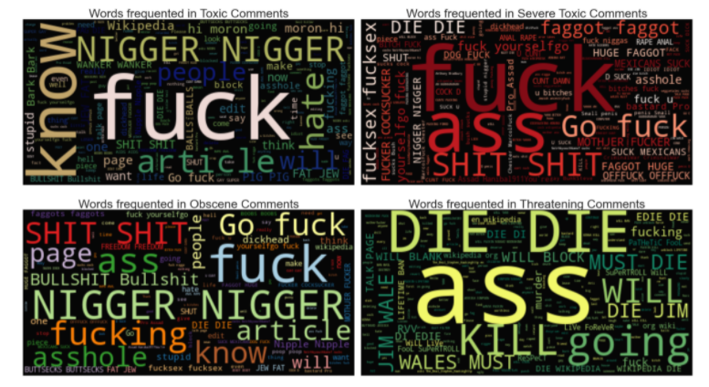
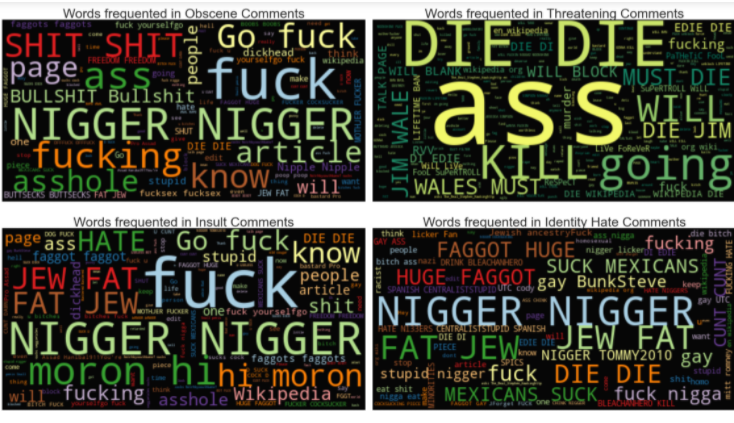

# Toxic-Classification

<p align="center">  </p>
<br>

## OVERVIEW
People express themselves freely and without reluctance at online platforms only when they feel comfortable. Any threat of abuse or harassment will make them leave the
conversation and prohibit them from participating in any good conversation in future. It is hence, a vital requirement for any organization or community to have an automated system which can identify such toxic comments and report/block the same immediately.

## PROBLEM STATEMENT
**Given a group of sentences or paragraphs, which was used as a comment by a user in an online platform, our task is to classify it to belong to one or more of the following categories :-**

```
1. toxic
2. severe-toxic
3. obscene
4. threat
5. insult
6. identity-hate
```

A multi-label classification problem differs from a multi-class classification problem (in which each sample can only be assigned to one of the many-labels). Hence in our problem each comment can belong to more than one label for eg, a comment can be obscene, toxic and insult, all at the same time.

Out of the total dataset used, 70% was used for training and 30% for testing. Each testing dataset was labeled and hence for each algorithm using the predictions and
labels, calculation of metrics such as hamming-loss, accuracy and log-loss was done. The final results have been compiled on the basis of values obtained by algorithmic models in hamming-loss and log-loss combined.


## Evaluation Metric
Unfortunately for the problem, as I did some data analysis. I found that toxic comments are rare. Just over 10% of this dataset is labeled as toxic, but some of the subcategories are extremely rare making up less than 1% of the data.

Because of this imbalance, accuracy is a practically useless metric for evaluating classifiers for this problem. The Kaggle challenge based on this dataset uses ROC/AUC, or the area under a receiver operating characteristic curve, to evaluate submissions. This is a very generous metric for the challenge, as axes for the curve represent recall (a.k.a. sensitivity), the ratio of positive predictions to all samples with that label, and specificity, the ratio of negative predictions to all negative samples. This metric would work well if the positive and negative labels were relatively even, but in our case, where one label represents less than a third of a percent of the data, it’s too easy to get a high score even with hardly any true-positive predictions.

Instead, I propose using an **F1 Score**, which severely penalizes models that just predict everything as either positive or negative with an imbalanced dataset.

## Data Analysis

### Exploration
This dataset contains 159,571 comments from Wikipedia. The data consists of one input feature, the string data for the comments, and six labels for different categories of toxic comments: toxic, severe_toxic,  obscene,  threat,  insult, and  identity_hate.

<p align="center">  </p>

<p align="center">  </p>

* The toxicity is not evenly spread out across classes. Hence we might face class imbalance problem.
* As there is imbalance so the main performance metric will be " Micro F1 Score "
* There are ~95k comments in the training dataset and there are ~21 k tags and ~86k clean comments!?
* This is only possible when multiple tags are associated with each comment (eg) a comment can be classified as both toxic and obscene.

<p align="center">  </p>

Here, We can see that there is some overlap between different labels. To get a better picture of the overlapping I will plot a correlation matrix.

<p align="center">  </p>

***So what do these comments look like? Let’s look at a few.***
Here, I will do a plot based on frequency of words.

<H4 align="center">Clean Comments </H4>
<p align="center">  </p><br>
<H4 align="center"> Not so clean Comments </H4>
<p align="center">  </p>

<p align="center">  </p>

In addition to the words themselves, i have extracted some other attributes of the comments (or features) that show contrast between toxic and clean comments.

<!-- <p align="center">  </p>
<p align="center">  </p>
<p align="center">  </p>
<p align="center">  </p>
<p align="center">  </p>
<p align="center">  </p> -->

* <H4>Length of Comments</H4>
On average, clean comments are about a third longer than toxic comments.<br>
* <h4>Capitalization in Comments per label</h4>
Toxic comments are more likely to be either in all caps or have no capitalization at all.<br>
* <h4>Length of words per label</h4>
Toxic comments average 4.1 characters per word, where clean comments average 4.4. <br>
* <h4>Question marks in Comments per label</h4>
My thought here is that more legitimate posts might have more question marks. But that assumption was wrong, as toxic comments have 50% more question marks per comment than clean comments. 0.6 Versus 0.4.</h4>
* <h4>Exclamation Marks in Comments per label</h4>
I made the opposite assumption about exclamation marks, and that paid off! Toxic comments have an average of 3.5 exclamation marks, while clean comments only have 0.3.<br>


## Data preprocessing

### Cleaning
* Lower Case 
* Removing HTML Tag
* Removing URL’s
* Removing punctuations
* Performing Stemming
* Removing Stopwords
* Expanding Contractions

### Feature Engineering

* Comment length in characters
* Percent of letters in a comment that are capitalized
* Average length of words in a comment
* Number of exclamation marks in a comment
* Number of question marks in a comment

### Vectorization

I am using a **term frequency – inverse document frequency (tf-idf)** statistic to vectorize
text. The number of features and presence of character n-grams is a parameter to tune for model optimization. *This technique takes into account not only the frequency of words or character n-grams in the text; it also takes into account the relevancy of those tokens across the dataset as a whole.*

## Modelling

As a natural language processing problem, is a classification task that involves high dimensionality data. We already vectorized the data and now test multiple classification algorithms. With the benchmark vectorization and features, we will experiment with multiple algorithms with default parameters to determine the most effective approach to the problem. The models we will use are:

* Logistic Regresssion *(Benchmark)* 🦖
* Multinomial Naive Bayes
* Support Vector Machine
* Support Vector Machine with Naive Bayes Features
* Linear SVC (SVM)

The baseline model is a Logistic Regression model fit to tf-idf vectorized comment text with using only words for tokens, limited to 10,000 features.

*The cross-validated F1 scores for each label break down as follows:*
<p align="center">  </p>
 
 
 The model has been trained, tested, and optimized using training and test subsets of the data. We will use an unseen holdout subset of the data to evaluate the model.
 <p align="center">  </p>
 
 
 ### Model Evaluation
 
 To compare the relative performances of each algorithm, We’re going to test them on the same preprocessed data as the benchmark, a tf-idf vectorized data with 10,000 features.
 
 **Here are the results:**
 <p align="center">  </p>
 <p align="center">  </p>
 <p align="center">  </p>
 <p align="center">  </p>


 
 In terms of overall performance, NB-SVM is the strongest performer and Linear SVC comes in at a close second. The multinomial naive bayes features don’t performed as we expected it to be coming on the last position but anyways the difference is less than 1 percent so there is nothing to complain about.
 
 *One thing to worth mention that “our primary goal was analyzing the F1 score which I think NB-SVM is a pretty clear winner here”.*
 
### Refinement

**Feature Engineering**
* Without Feature Engineering:
<p align="center">  </p>

* With Feature Engineering:
<p align="center">  </p>


### Hyperparameter Tuning
<p align="center">  </p>

<p align="center">  </p>


## Results

<H4 align="center">toxic</H4>
<p align="center">  </p>
<H4 align="center">severe_toxic</H4>
<p align="center">  </p>
<H4 align="center">obscene</H4>
<p align="center">  </p>
<H4 align="center">threat</H4>
<p align="center">  </p>
<H4 align="center">insult</H4>
<p align="center">  </p>
<H4 align="center">identity_hate</H4>
<p align="center">  </p>
<H4 align="center">clean</H4>
<p align="center">  </p>

<br>
Overall, I do believe that this model is robust enough for this application and it offers a large advantage over both the standard approach of human flagging for review (though I wouldn’t eliminate that as a feature) and an out-of-the-box model.
